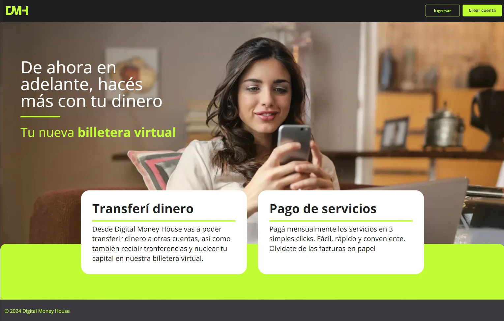

# Digital Money House

Hola!, este es mi proyecto final de la especialización Frontend del programa Certified Tech Developer de Digital House.

La App Digital Money House es una billetera virtual desarrollada con Next.js que permite a los usuarios realizar pagos de servicios, gestionar sus finanzas personales y utilizar la billetera en mobiles, tabletas o escritorios.

## Instalación

1. Clonar el archivo .env.example y renombrarlo a .env:

```bash
   cp .env.example .env
```

2. Para instalar y ejecutar el proyecto localmente:

```bash
   git clone <URL_DEL_REPOSITORIO>
```

3. Instala las dependencias del proyecto:

```bash
   npm install
```

4. Ejecuta el proyecto en modo de desarrollo:

```bash
   npm run dev
```

#### IMPORTANTE: Al momento de creación de una cuenta el codigo de verificación en "000" o puedes recargar la página si fue una creacion exitosa para luego logearte.


## Funcionalidades Principales

### Sprint 1: Inicio, Registro y Acceso

#### Épica: Inicio, registro y acceso

- **Inicio**
  * [x] Posibilidad de usar el producto desde desktop, tablet y mobile.
  * [x] Visualización de la comunicación del producto y funcionalidades principales (transferencias y pago de servicios).
  * [x] Uso de textos desde la base de datos.
  * [x] Acceso directo a "Iniciar sesión" y "Registro".

- **Registro**
  * [x] Validaciones de los datos ingresados.
  * [x] Registro correcto tras validación de datos.
  * [x] Mensaje acorde ante datos incorrectos.
  * [x] Redirección a la página de Login tras registro correcto.

- **Acceso**
  * [x] Validar campos requeridos (email y contraseña).
  * [x] Mensaje acorde en la pantalla de login.
  * [x] Ingreso de usuario y contraseña en dos pasos/pantallas distintas.
  * [x] Redirección a /home tras login correcto.
  * [x] Link de registrar cuenta redirige a la pantalla de "Registro".

- **Cierre de Sesión**
  * [x] La sesión no se cierra al recargar el navegador.
  * [x] Redirección a la página promocional tras cerrar sesión.
  * [x] Eliminación del token del local storage al cerrar sesión.


### Sprint 2: Dashboard, Mi Perfil y Gestión de Medios de Pago

#### Épica: Dashboard

- **Inicio**
  * [x] Dos centavos de detalle en el importe expresados en ARS.
  * [x] Visualización de la cantidad de dinero disponible con accesos directos a las secciones de “Ingresar dinero” y “Ver mi CVU”.
  * [x] Barra lateral con el menú siempre visible.

- **Actividad**
  * [x] Resumen de los últimos movimientos de ingreso y egreso de dinero con un buscador.
  * [x] Botón de “Ver toda la actividad”.
  * [x] Campo para ingresar la búsqueda con funcionalidad futura.

#### Épica: Mi Perfil

- **Datos Personales**
  * [x] Editar los datos personales y el alias desde la misma pantalla y guardar los nuevos datos.
  * [x] Alias conformado por 3 palabras separadas por puntos “X.X.X”.
  * [x] Copiar el CVU y alias al clipboard.
  * [x] La contraseña debe aparecer invisible con (******).
  * [x] Al presionar el botón de “Gestionar medios de pago”, redirigir a la página de “Gestión de medios de pago”.

#### Épica: Gestión de Medios de Pago

- **Agregar Tarjeta**
  * [x] Al apretar el botón de “Alta de tarjeta”, redirigir a la pantalla de alta de tarjeta.
  * [x] Máximo de 10 tarjetas. Mensaje si se llega al límite.
  * [x] Mostrar tipo de tarjeta (Visa, Mastercard, AMEX) detectado por los primeros 4 dígitos de la tarjeta.

- **Ver Tarjetas**
  * [x] Mostrar todas las tarjetas asociadas a la cuenta.
  * [x] Mostrar solo los últimos 4 dígitos de la tarjeta.

- **Eliminar Tarjeta**
  * [x] Al eliminar la última tarjeta, mostrar el mensaje: “No tienes tarjetas asociadas”.


### Sprint 3: Ingreso de Dinero y Mi Actividad

#### Épica: Ingreso de Dinero

- **Medios de Pago**
  * [x] Listar medios de pagos dados de alta.
  * [x] Seleccionar medios de pago adheridos.
  * [x] Ingresar el monto a cargar.
  * [x] Pantalla resumen de comprobante de ingreso.
  * [x] Ver CVU y alias de cuenta.
  * [x] Copiar y guardar en memoria CVU y alias.

#### Épica: Mi Actividad

- **Historial de Transacciones**
  * [x] Ver toda la actividad realizada, paginada y filtrada.
  * [x] Filtrar por período (hoy, ayer, semanas, meses).
  * [x] Filtrar por tipo de operaciones (ingresos o egresos).
  * [x] Paginación de 10 transacciones por página.
  * [x] Buscar por palabras claves en el título de la transacción.
  * [x] Borrar filtros mediante un botón.


### Sprint 4: Pago de Servicios

#### Épica: Pago de Servicios

- **Servicios Disponibles**
  * [x] Ver lista de servicios disponibles para pago.
  * [x] Ver servicios sin paginar.
  * [x] Usar buscador por título.

- **Pago de Servicio**
  * [x] Ingresar número de cuenta del servicio.
  * [x] Seleccionar medio de pago.
  * [x] Agregar nuevo medio de pago.
  * [x] Seleccionar medio de pago existente.
  * [x] Ver resultado del pago.
  * [x] Mostrar resumen de transacción.
  * [x] Mostrar mensaje de error por insuficiencia de fondos.


### Testing
  * [x] Realizar pruebas manuales y automatizadas pertinentes.


### Infraestructura
  * [x] Desplegar proyecto para ser visualizado en la web.


## Tecnologías Utilizadas

- **Next.js**: Framework de React para aplicaciones web.
- **React**: Librería de JavaScript para construir interfaces de usuario.
- **Tailwind CSS**: Framework de CSS para diseñar interfaces de usuario modernas y responsivas.
- **React Hook Form**: Librería para manejar formularios en React.
- **clsx**: Utilidad para construir clases condicionales.
- **Zustand**: Librería liviana alternativa a Redux o Context API para el manejo de estados en React.
